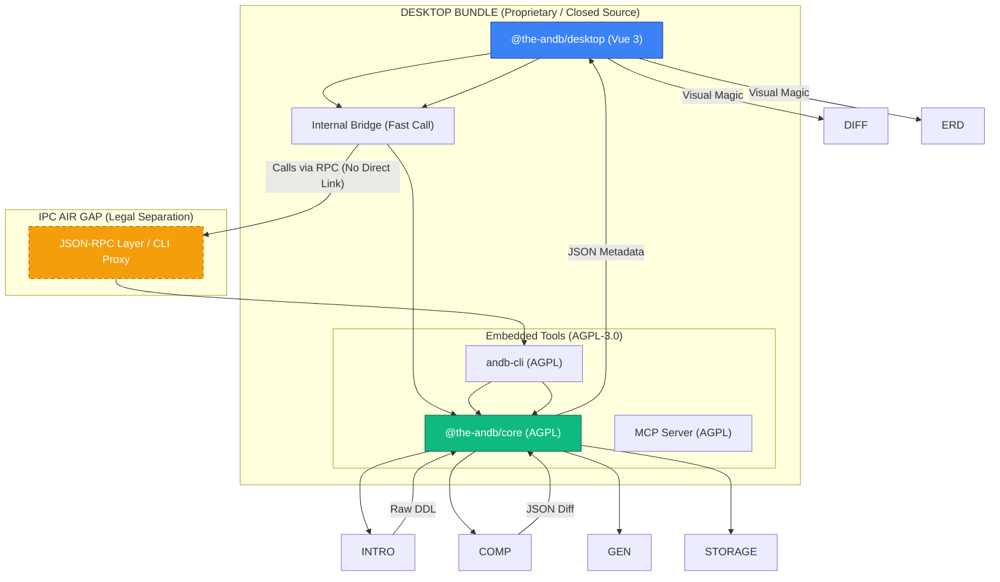

# 🏗️ System Design — TheAndb Ecosystem

Đây là thiết kế hệ thống cốt lõi để duy trì mô hình **Open Core**. Bất kỳ thay đổi kiến trúc nào cũng phải tuân thủ ranh giới giữa **Open Source** (AGPL-3.0) và **Proprietary** (Closed source).

## 🗺️ Quy ước "Không Đi Lạc"

### 1. Luật Flow Dữ Liệu

- **Core → Desktop**: Chỉ trả về **JSON Metadata thô**. Tuyệt đối không trả về HTML/CSS hay bất cứ thứ gì liên quan đến hiển thị.
- **Desktop → Core**: Gửi lệnh thực thi (`compare`, `export`, `migrate`) kèm tham số qua RPC.

### 2. KISS (Keep It Simple, Stupid)

- **Modularity**: Code vẫn được chia thành các package riêng biệt trong monorepo để dễ test và reuse.
- **Bundling**: Khi build Desktop, chúng ta pack luôn Core/CLI/MCP vào. User chỉ cần 1 cái file `.dmg` là có tất cả.
- **No Over-engineering**: Gọi trực tiếp qua code (internal link) nếu nó nhanh và đơn giản hơn RPC, miễn là giữ được ranh giới Domain logic.

### 3. Vùng Cấm (The DMZ)

- Mặc dù dùng license **MIT** cho Core đã loại bỏ rủi ro pháp lý "viral", nhưng chúng ta vẫn duy trì ranh giới kiến trúc để đảm bảo bản Desktop cực sạch, dễ maintain và không bị phụ thuộc vào binary version của Core.

## 🛡️ Tại sao cái Air Gap này KHÔNG phải là Over-engineering?

1.  **Tính Linh Hoạt**: Cho phép Core chạy được cả ở CLI, MCP, và App mà không cần link cứng.
2.  **Tách biệt Runtime**: Electron chạy Node version khác, Core chạy Node version khác cũng không sao. Giải quyết triệt để lỗi Native Binary (`better-sqlite3`).
3.  **Bảo mật thương mại**: Dễ dàng đóng gói các tính năng "Premium" vào bản Desktop mà không vô tình leak code vào Open Source Core.

---

> [!IMPORTANT]
> Vi phạm ranh giới này = Revert toàn bộ. Không thảo luận.
