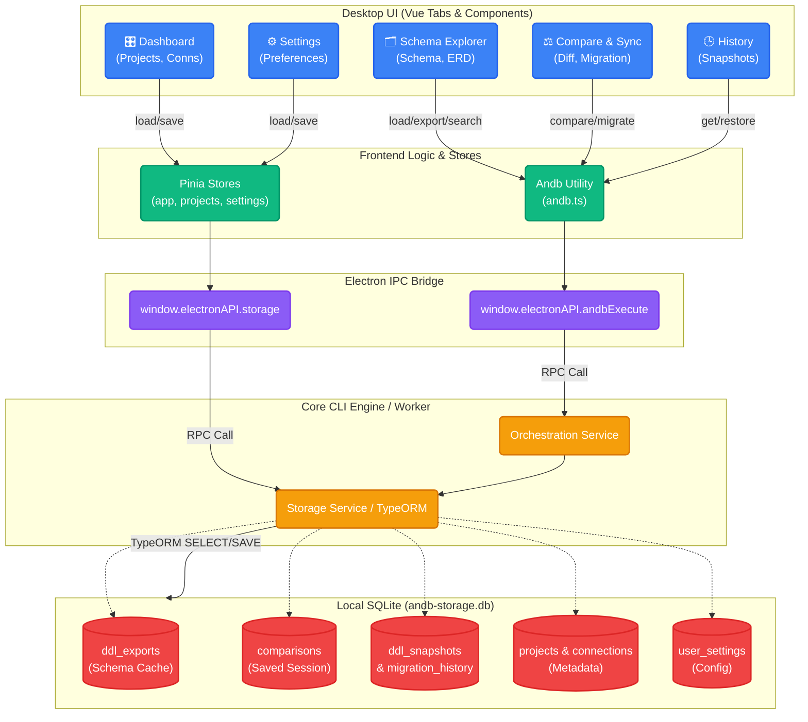

# 📋 Bảng Check-list 100% Các Chức Năng Dùng SQLite Trong Ứng Dụng Desktop

Bảng liệt kê chính xác 100% các **Tab / View**, **File Component**, **Hàm Vue gọi**, và **Tác vụ tương đương từ SQLite (qua IPC và Core Engine)**. 

Toàn bộ Backend dùng SQLite (`andb-storage.db`) thông qua 2 ngõ chính:
1. `Andb.*` (vào `core-bridge`)
2. `storage.*` (thông qua `window.electronAPI.storage`)

---

## 1. 🗂️ Schema Explorer Tab (Khám Phá Cấu Trúc Bảng)
*Giao diện chính để xem bảng lưới, ER Diagram, Code DDL...*

| File Component | Logic / Function | Giao tiếp SQLite | Bảng SQLite bị ảnh hưởng |
| :--- | :--- | :--- | :--- |
| `GlobalSchemaView.vue` | `loadSchema(false)` | `Andb.getSchemas()` | Đọc từ `ddl_exports` (Cache Load) |
| `GlobalSchemaView.vue` | `loadSchema(true)`  *(Bấm Nút Refresh)* | `Andb.export()`  sau đó `Andb.getSchemas()` | Ghi mới vào `ddl_exports` sau đó đọc lại |
| `GlobalSchemaView.vue` | `performContentSearch()`  *(Tìm code DDL)* | `Andb.search()` | Đọc/Query LIKE từ `ddl_exports` |
| `GlobalSchemaView.vue` | `clearConnectionData()` | `Andb.clearConnectionData()` | Xóa data trong `ddl_exports` & `comparisons` |
| `GlobalSchemaView.vue` | `takeSnapshot()` | `Andb.createSnapshot()` | Ghi mới vào `ddl_snapshots` |
| `SchemaDiagram.vue` | `autoLayout() -> parseColumns` | Lấy từ `table.content` (Props do cha truyền) | Data lấy sẵn từ `ddl_exports` không gọi IPC |

---

## 2. ⚖️ Compare & Sync Tab (So Sánh & Đồng Bộ)
*Thực thi so sánh 2 connection và chạy Migration.*

| File Component | Logic / Function | Giao tiếp SQLite | Bảng SQLite bị ảnh hưởng |
| :--- | :--- | :--- | :--- |
| `Compare.vue`  `ProjectsColumnsView.vue` | `loadSchemas()` | `Andb.getSchemas()` | Đọc danh sách cấu trúc từ `ddl_exports` |
| | `runCompare()` | `Andb.compare()` | Đọc DDL gốc & Ghi kết quả vào `comparisons`, `comparison_items` |
| | `loadSavedResults()` | `Andb.getSavedComparisonResults()` | Đọc Session so sánh cũ từ `comparisons` |
| | `runMigration()` | `Andb.migrate()` | Ghi Log vào `migration_history` |
| | `runMigration()` *(Pre-hook)* | `Andb.createSnapshot()` | Ghi backup target vào `ddl_snapshots` |
| | `runMigration()` *(Post-hook)* | `Andb.export()` | Ghi nhật ký vào lại `ddl_exports` |

---

## 3. 🕒 History Tab (Lịch sử & Phục hồi)
*Lưu các Snapshot code và Backup Schema trước khi Migrate.*

| File Component | Logic / Function | Giao tiếp SQLite | Bảng SQLite bị ảnh hưởng |
| :--- | :--- | :--- | :--- |
| `History.vue` | `loadSnapshots()` | `Andb.getAllSnapshots()` | Đọc toàn bộ từ `ddl_snapshots` |
| `History.vue` | `restoreSnapshot()` | `Andb.restoreSnapshot()` | Đọc code từ `ddl_snapshots` để chạy |

---

## 4. 🎛️ Dashboard & Projects List (Trang Chủ & Dự án)
*Quản lý danh sách các dự án, môi trường (Environments), Cấu hình lưu tạm.*

| File Component / Store | Logic / Function | Giao tiếp SQLite | Bảng SQLite bị ảnh hưởng |
| :--- | :--- | :--- | :--- |
| `stores/projects.ts` `ProjectsListView.vue` | `init()` -> `storage.getProjects()` | `window.electronAPI.storage.get` | Đọc bảng `projects` |
| | `addProject() / duplicateProject()` | `storage.saveProjects()` | Ghi vào `projects` |
| `stores/app.ts` | Load Data (Boot) | `storage.getConnections()` | Đọc cấu trúc `connections` |
| `stores/connectionPairs.ts` | Load Data (Boot) | `storage.getConnectionPairs()`| Đọc cấu trúc flow (Cặp so sánh) |
| `stores/sidebar.ts` | Truy xuất Setting git | `electronAPI.storage.get` | Đọc `metadata` hoặc settings | 

---

## 5. ⚙️ Settings & Preferences (Cài Đặt Hệ Thống)
*Lưu cấu hình UI, tuỳ chọn kết nối, theme, phân quyền.*

| File Component / Store | Logic / Function | Giao tiếp SQLite | Bảng SQLite bị ảnh hưởng |
| :--- | :--- | :--- | :--- |
| `Settings.vue` `stores/settings.ts` | `saveSettings()` | `storage.set('settings')` / `updateSettings` | Ghi/Sửa bảng `user_settings` |
| `ProjectSettings.vue` | `saveProject()` | `storage.saveProjects()` | Lưu thay đổi thuộc tính `projects` |
| `ConnectionForm.vue` | Luồng Edit Connection | `storage.updateConnection()` | Update Data nguồn DB kết nối |

---

### Tổng Kết Đường Đi (Data Flow):
Mọi tương tác từ **Tất cả các Tab** nói trên đều 100% sẽ gom về:
1. File: `andb-desktop/src/utils/andb.ts` -> gửi qua IPC Renderer (`window.electronAPI.andbExecute`)
2. File: `andb-desktop/src/utils/storage-ipc.ts` -> gửi qua Storage IPC (`window.electronAPI.storage.get/set`)

Cả 2 Endpoint này đều được bắt ở Background CLI Worker và đẩy vào trực tiếp các Entity TypeORM đã được Migration trong Database `andb-storage.db` (như ông thấy log lúc server khởi động).

### Sơ đồ Data Flow (Mermaid Flowchart)

