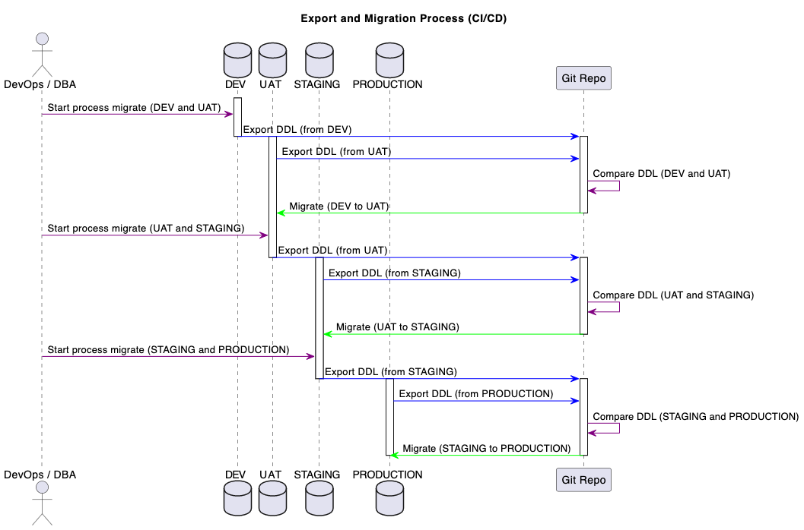

# Flo Database Migration Tool

This logic allows us can manage the Flo Database (MySQL) via export, compare, and migrate SQL DDL(Data Definition Language such as tables, functions, and store procedures) to different environments. The scripts are written in JavaScript and can be executed using Node.js.

## 📊 Workflow Overview



The migration process follows a structured CI/CD pipeline across multiple environments:

- **DEV** → **UAT** → **STAGE** → **PROD**

Each migration phase includes:
1. **Export** DDL from both source and target environments
2. **Compare** to identify differences and generate reports
3. **Migrate** changes with automatic backup and rollback capability

This support developer uses the LOCAL environment to work before migrating to DEV environment.

## 📋 Change Tracking

The following DDL change will be recorded and used as a report to help the Admin have an overview before migrating to the next environments:

- All newly created tables, functions, store procedures
- All newly updated tables (such as index, trigger, constraint, foreign key)
- All recently deprecated tables, functions, and store procedures

> **Note**: Report all deprecated items in Flo's database without taking any automated actions. Manual intervention by DBA and DevOps is required for handling these deprecated items.

- Report to JSON and HTML to help visualize
- Versioning on Github for all changed code same with other backend's coding repository

## 🚀 Installation

Before running the scripts, make sure we have Node.js and npm (Node Package Manager) installed. Then, follow these steps:

### Clone the repository:
```bash
git clone https://github.com/LeftCoastLogic/FloStoreProcedureBE.git
```

### Navigate to the project directory:
```bash
cd FloStoreProcedureBE
```

### Install the dependencies:
```bash
npm install
```

## 📖 Usage

The scripts provided in this repository are designed for tracking differences between 2 environments nearest to each other.

In this document, the following shortcut will be used instead of the full environment name:

- **dev**: Development environment (DEV)
- **uat**: User acceptance testing environment (UAT)
- **stage**: Staging environment (STAGE)
- **prod**: Production environment (PROD)

### EXPORT

To export the contents of the LOCAL environment, use:
```bash
npm run export:local
```

To export the contents of the DEV environment, use:
```bash
npm run export:dev
```

To export the contents of the UAT environment, use:
```bash
npm run export:uat
```

To export the contents of the STAGE environment, use:
```bash
npm run export:stage
```

To export the contents of the PRODUCTION environment, use:
```bash
npm run export:prod
```

> **Note**: The export command is designed to help version all DDL components via git.

### COMPARE

To compare the LOCAL environment with DEV environment to prepare for deployment, use:
```bash
npm run compare:dev
```

To compare the DEV environment with UAT environment to prepare for deployment, use:
```bash
npm run compare:uat
```

To compare the user acceptance testing UAT environment with the STAGE environment to prepare for deployment, use:
```bash
npm run compare:stage
```

To compare the STAGE environment with the PRODUCTION environment to prepare for deployment, use:
```bash
npm run compare:prod
```

Example a compare report for admin:

> **Note**: Compare command will automatically trigger export SOURCE and DESTINATION environment

### MIGRATE

To migrate the LOCAL environment to DEV environment, use:
```bash
npm run compare:local
```

To migrate the DEV environment to UAT environment, use:
```bash
npm run migrate:uat
```

To migrate the UAT environment to the STAGE environment, use:
```bash
npm run migrate:stage
```

To migrate the the STAGE environment with the PRODUCTION environment, use:
```bash
npm run migrate:prod
```

> **Note**: 
> - Ensure that we have run the compare command before attempting to migrate.
> - Before initiating the MIGRATE process, it is necessary for the CI/CD pipeline to confirm that a backup snapshot has already been taken.
> - During the migration process, if any error occurs, this migration process will roll back to the last state.

## 🔄 HOW TO ROLLBACK

**Note**: In this entire process, the only step that modifies the DB schema is the migrate step.

Before the migration process executes, the CI/CD pipeline has an auto-trigger to take a DB snapshot.

During the migration process, if any error occurs, this migration process will roll back to the last state.

If the migration process encounters issues and can't roll back to the previous state, reverting to the DB snapshot is a reliable alternative:

1. **Identify the Issue**: Recognize the problem encountered during the migration process that prevents a rollback.

2. **Access the DB Snapshot**: Access the DB snapshot taken before the migration process started. This snapshot contains the data as it existed before the migration.

3. **Restore the Snapshot**:
   - Log in to your MySQL database using a tool like MySQL Workbench or a command-line interface.
   - Identify the snapshot you want to restore. This could be a backup file or a snapshot of the database taken before the problematic migration.
   - Execute commands or use tools provided by your database management system to restore the snapshot.

   For example, using MySQL command line:
   ```bash
   mysql -u <username> -p <database_name> < snapshot_file.sql
   ```

4. **Validate and Confirm**: After restoring the snapshot, check the database to ensure that the data and structure are back to the state captured in the snapshot.

## 🐛 Issues

If we encounter any issues or have suggestions for improvements, please visit the issue tracker to report them. your feedback is valuable in enhancing these migration scripts.