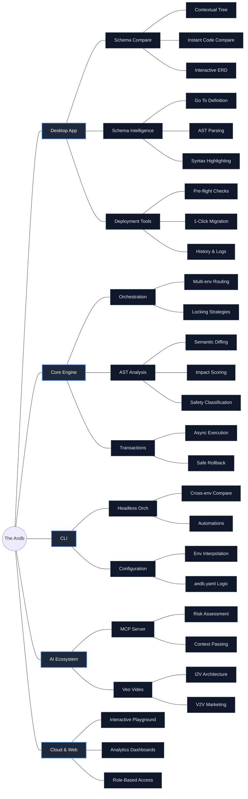

# The Andb: Feature Ecosystem

```mermaid
flowchart LR
    Root(("The Andb"))

    %% Categories
    Desktop["Desktop App"]
    Core["Core Engine"]
    CLI["CLI"]
    AI["AI Ecosystem"]
    Web["Cloud & Web"]

    %% Connect Root to Categories
    Root --- Desktop
    Root --- Core
    Root --- CLI
    Root --- AI
    Root --- Web

    %% Desktop App Features
    Desktop --- SComp["Schema Compare"]
      SComp --- SComp1["Contextual Tree"]
      SComp --- SComp2["Instant Code Compare"]
      SComp --- SComp3["Interactive ERD"]
    Desktop --- SIntel["Schema Intelligence"]
      SIntel --- SIntel1["Go To Definition"]
      SIntel --- SIntel2["AST Parsing"]
      SIntel --- SIntel3["Syntax Highlighting"]
    Desktop --- DepTools["Deployment Tools"]
      DepTools --- DepTools1["Pre-flight Checks"]
      DepTools --- DepTools2["1-Click Migration"]
      DepTools --- DepTools3["History & Logs"]

    %% Core Engine Features
    Core --- Orch["Orchestration"]
      Orch --- Orch1["Multi-env Routing"]
      Orch --- Orch2["Locking Strategies"]
    Core --- AST["AST Analysis"]
      AST --- AST1["Semantic Diffing"]
      AST --- AST2["Impact Scoring"]
      AST --- AST3["Safety Classification"]
    Core --- Trans["Transactions"]
      Trans --- Trans1["Async Execution"]
      Trans --- Trans2["Safe Rollback"]

    %% CLI Features
    CLI --- Head["Headless Orch"]
      Head --- Head1["Cross-env Compare"]
      Head --- Head2["Automations"]
    CLI --- Config["Configuration"]
      Config --- Config1["Env Interpolation"]
      Config --- Config2["andb.yaml Logic"]

    %% AI Ecosystem
    AI --- MCP["MCP Server"]
      MCP --- MCP1["Risk Assessment"]
      MCP --- MCP2["Context Passing"]
    AI --- Veo["Veo Video"]
      Veo --- Veo1["I2V Architecture"]
      Veo --- Veo2["V2V Marketing"]

    %% Cloud & Web
    Web --- Web1["Interactive Playground"]
    Web --- Web2["Analytics Dashboards"]
    Web --- Web3["Role-Based Access"]

    %% Styling
    classDef category fill:#1e293b,stroke:#3b82f6,stroke-width:2px,color:#f8fafc;
    classDef feature fill:#0f172a,stroke:#475569,stroke-width:1px,color:#e2e8f0;
    
    class Desktop,Core,CLI,AI,Web category;
    class SComp,SIntel,DepTools,Orch,AST,Trans,Head,Config,MCP,Veo,Web1,Web2,Web3,SComp1,SComp2,SComp3,SIntel1,SIntel2,SIntel3,DepTools1,DepTools2,DepTools3,Orch1,Orch2,AST1,AST2,AST3,Trans1,Trans2,Head1,Head2,Config1,Config2,MCP1,MCP2,Veo1,Veo2 feature;
```
